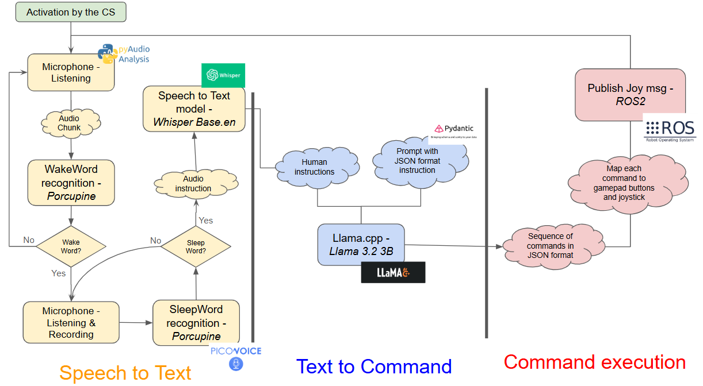

# Xplore - Enabling Human-Rover Communication

[Link to Medium article](https://medium.com/elca-it/human-robot-communication-for-embedded-systems-2a6d040daadc)
Check Main branch

Welcome to the Human-Rover Communication project GitHub. The goal is to develop a rover capable of recognizing, understanding, and executing vocal commands (e.g., _Hello Kerby, go forward for 3 meters and turn 70 degrees left. Goodbye!_). Navigation and other commands must be highly precise, leaving no room for interpretation by the model (angle or distance). 

This GitHub repository serves to enhance reproducibility, documentation, and installation guidance.

## Table of Contents

- [Introduction](#introduction)
- [Model Overview](#model-overview)
  - [Speech-to-Text](#speech-to-text)
  - [Text-to-Commands](#text-to-commands)
  - [Command Execution](#command-execution)
- [Accepted Commands](#accepted-commands)
- [Installation](#installation)
- [Future work](#future-work)

## Introduction

The high level workflow of the vocal instruction system is the following:



The model is designed to be lightweight, work offline, and recognize English vocal commands. A switch from the Control Station (CS) controls whether the vocal instruction system is activated.

The vocal insctruction system is a ROS node called `vocom_node` that subscribes to the `/CS/vocom_activation_service` topic (receives a boolean value from the switch). When the CS switch is activated, it starts running. It publishes [Joy messages](https://docs.ros2.org/foxy/api/sensor_msgs/msg/Joy.html) to `/CS/NAV_gamepad` topic. The idea is to create _fake_ joystick messages for manual navigation mode. The joystick messages are then processed as if the joystick or gamepad buttons were actually used. They are further processed into a [Twist message](https://docs.ros2.org/foxy/api/geometry_msgs/msg/Twist.html) for execution (see Xplore doc).

When vocal insctruction system starts running, it starts a PyAudio stream from the microphone. First, it invokes the Speech-to-Text (S2T) model, and the text is then fed to the Text-to-Commands (T2C) model. Finally, the system checks for the creation or modification of `commands.json` written by T2C and sequentially executes the series of commands it contains. Throughout this workflow, several print statements ensure transparency, allowing the user to verify the rover's understanding from the CS. These include detecting wake words, the Whisper model's speech recognition result, the JSON generated by the LLM, and the executed commands.

## Model Overview

### 1. Speech-to-Text

As shown in the Project Overview, the S2T process combines two models:

[comment]: <> (1. Vosk. First, Vosk is used. It has a lower WER rate but is less robust to noise. However, it is ideal for background processes for two reasons:   It is lightweight (~50MB in size / ~300MB of RAM during runtime for the Small English Vosk 40M model). b. It only needs to recognize specific distinguishable words: `Hello` is the wake word. It signals the user is about to give commands, and the system starts recording audio. `Goodbye` is the sleep word. It signals the end of user instructions, stopping the audio recording (which is then passed to Whisper).)

#### Porcupine by Picovoice
Porcupine is a model specifically designed for wake word recognition and is easily trainable from the Picovoice console. It is ideal for background processes for two reasons:  
- It is lightweight (model file is only 4kB)
- It is robust to noise
- It only needs to recognize specific distinguishable words:  
   - `Hey Xplore` is the wake word. The system starts recording audio. The user can give his/her insctructions 
   - `Bye Xplore` is the sleep word. The system stops recording audio. The user stops giving instructions

#### Whisper by OpenAI
Whisper is the state-of-the-art speech recognition model from OpenAI. Whisper Base (74M) is robust against Martian-like or crowd noise. It achieves better performance with 30-second-long audio clips due to its attention mechanism. This mechanism helps to decode words at the end of an audio chunk using the context from the beginning of the chunk. This is why Whisper is not suitable for live wake words detection tasks. Additionally, it requires more computational resources. Whisper needs about 1GB of VRAM during runtime but only runs for a few seconds when the audio is recorded and passed to it.

Vosk is an speech recognition framework for embedded systems. It was previously used instead of Porcupine but was not robust to noise. The following example demonstrates the improvement in speech recognition between Vosk and Whisper:


### 2. Text-to-Commands

This component converts the transcribed, unstructured vocal instructions into a structured JSON format. The JSON contains a series of commands, listed as follows:

```python
import pydantic

class RoverCommand(BaseModel):
    command: Literal["move", "turn", "drill", "cameras", "not_a_command"] = Field(description=("Type of command to execute."))
    direction: Optional[Literal["forward", "backward", "right", "left", "180_turn", "360_turn"]] = Field(None, description="Direction of movement or rotation, depending on the command")
    execution_speed: Optional[Literal["fast", "slow", "default"]] = Field(None, description="Execution speed for the mission")
    distance: Optional[float] = Field(None, description="Distance in meters, null otherwise")
    angle: Optional[float] = Field(None, description="Rotation angle in degrees, null otherwise")

class MissionPlan(BaseModel):
    commands: List[RoverCommand] = Field(description="List of commands to be executed by the rover")

```

This schema was chosen for two reasons:
1. It is easy for the LLM to generate a valid instance (compared to nested parameters)
2. It simplifies the future addition of new commands

The model used is Llama 3.2 3B. We prompt the system with the following context and few-shots learning: 

```python
"""You are assisting a rover's navigation and control system to interpret user instructions accurately. Your task is to identify specific commands (such as "move," "turn", "drill" or "cameras") and their details (such as distance, angle or execution speed) from the provided instructions.

Examples:

Input: "Spin on yourself 1/3 to the right"
Output:
{
  "commands": [
    {
      "command": "turn",
      "direction": "right",
      "angle": 120
    }
  ]
}

Input: "Advance quickly 12 meters, stop, turn on the cameras and finally drill a hole."
Output:
{
  "commands": [
    {
      "command": "move",
      "direction": "forward",
      "execution_speed": "fast",
      "distance": 12,
    },
    {
      "command": "cameras",
      "camera_toggle": "turn_on"
    },
    {
      "command": "drill"
    }
  ]
}

Input: "Please turn slowly left 90 degrees and then drive backwards a little, maybe one meter."
Output:
{
  "commands": [
    {
      "command": "turn",
      "direction": "left",
      "execution_speed": "slow",
      "angle": 90
    },
    {
      "command": "move",
      "direction": "backward",
      "distance": 1
    }
  ]
}"""
```

[comment]: <> ()

We use a Llama model wrapper called [Llama.cpp](https://github.com/ggerganov/llama.cpp). It has a [`JSON Schema Mode`](https://llama-cpp-python.readthedocs.io/en/latest/#json-mode) which guarantees that the output is a valid JSON instance following the specified schema. The model can be easily changed as long as it is in gguf format. We use quantized LLama-3.2-3B-Instruct-Q6_K_L.gguf version from [Hugging Face](https://github.com/ggerganov/llama.cpp). 

### 4. Commands execution
Once the commands are loaded into a JSON file, we iterate through and execute them sequentially. Each command is translated into a Joy message and published to the `/CS/NAV_gamepad` topic. 

The system focuses on navigation commands:
- Backward or forward: default speed is $0.5,m/s$ (i.e., 0.5 as published in Joy)
- Rotation: default speed is $0.5,rad/s$ (i.e., 0.5 as published in Joy)
The parameter `execution speed` is a factor that multiplies the default speed. It is 1 by default, 0.5 when set to `slow`, and 1.5 when set to `fast`. 

We fix the speed and the user ask for a distance, so the message is published for a duration $ t = \frac{d}{v} $.

At any step, you can deactivate the vocal instruction system and it will stop. Interrupt the system using the CS (send `False` bool to `/CS/vocom_activation_service`). The interruption can occur during the audio recording, the transcription or the message publication. This ensure safe use in critical situation. Additionally, all print statements of the system workflow can be followed with a topic listener. 


## Accepted commands
The currently accepted commands are:

- `move`: Requires the `direction` field (either `forward` or `backward`) and the `distance` field (in meters, positive integer). If no `distance` is specified, the rover will not move. If a `distance` is specified but no `direction`, the rover defaults to moving forward.

- `turn`: Requires the `direction` field (either `left`, `right`, `180_turn`, or `360_turn`) and the `angle` field (in degrees, positive integer). If `direction` is `left` or `right` with angle as null or 0, it defaults to turning 90 degrees. If the `direction` is `180_turn` or `360_turn` but no `left` or `right` is specified, it defaults to turning left.

[comment]: <> (E.g., if you want to go diagonnally, first ask to go to turn an angle and then to advance in that direction. Drill + manual nav ou auto mode + mode de deplacement normal ou latéral. Dire qu'on fait seq et que les rotations sont en mode de deplacement crab.)

_Note:_ Other commands like drill and camera usage has partially handled (until T2C basically), but additional work is required to implement ROS execution. 


## Installation

Docker must be installed and running on your system. For guidance, refer to this [Xplore repository](https://github.com/EPFLXplore/ROS_Software_Assignement/blob/master/docs/InstallLinux.md). For additional guidance, you can learn to create a ROS package and run nodes by following the instructions provided in this [GitHub repository](https://github.com/EPFLXplore/ROS_Software_Assignement/blob/master/docs/Level2.md).

### Build and Run the Docker Container
1. Navigate to the folder `docker_humble_desktop`. If the Docker container is not already running, start it using the run.sh script for Linux. Then access the docker container terminal.
```sh
./run.sh
docker rm -f 2c3a0a05940a1e31582aab5c27f8e71406426e419e54c08d5a07f9d2fec2aed5 (if needed)
docker exec -it epflxplore_vocal_command bash
```
If an error occurs showing the missing command `docker-compose`, install it using `sudo apt-get update && sudo apt-get install -y docker-compose`

### Build and Run the Ros Package
2. In the dev_ws directory, build the package:
```sh
cd ~/dev_ws/
colcon build
```
This command compiles the package and sets up the necessary environment.

3. After building, source the setup file to overlay the workspace on your environment:
```sh
. install/setup.bash
```
This command sets up the environment variables needed to run the nodes. Now, your terminal is aware of the existing nodes. You will have to execute this command on every terminal you open to help it find your nodes.

4. Run the first node:
```sh
ros2 run vocal_command_pkg vocom_node
```

If the lines 63 to 66 of the `node.py` file are commented, you can test the system with another fake control station node that you have to start. To start it, follow this instruction; ortherwise the system will start automatically after the last step. 

5. Open a new terminal, go inside the Docker container and run the second node:
```sh
docker exec -it epflxplore_vocal_command bash
. install/setup.bash
ros2 run vocal_command_pkg fake_cs_node
```

6. **Optionnal** _How to create a ROS package (inside a running Docker container)_:
```sh
cd src
ros2 pkg create --build-type ament_python vocal_command_pkg
```

## Future work

1. Mount the Logitec microphone on the rover
The microphone used is a [Multidirectional Microphone](https://www.logitech.com/fr-ch/shop/p/yeti-orb-gaming-microphone.988-000551) from Logitech, which will be set on the rover. 

2. Add additional commands
- All commands emited from the gamepad can be easily handled by our app. The script make it easily understable to modify and maintain it
- Drill ROS execution
- Cameras ROS execution

3. Deploy on new Jetson: 
- Pull the github from the Jetson
- Add your porcupine key to `.env` 
- Download and add Llama quantitized model into model folder
- Check docker compose volume and dockerfile copy. Hardware should have the following folder for mic access and results output: volume in docker-compose
- Follow [Installation](#installation) steps

4. Sentiment analysis
- What is the added value of this? 
- Gadget that will not be used once on the rover
- Might lead to unpredicatble execution from the rover so bad idea
