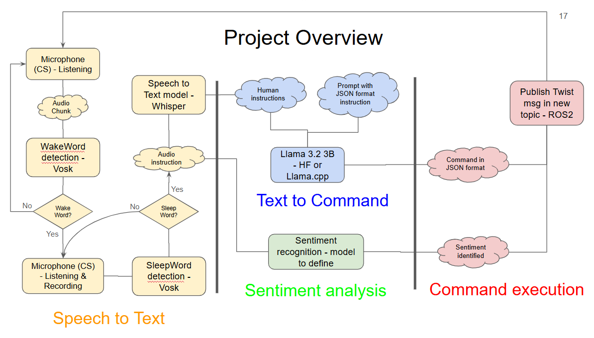
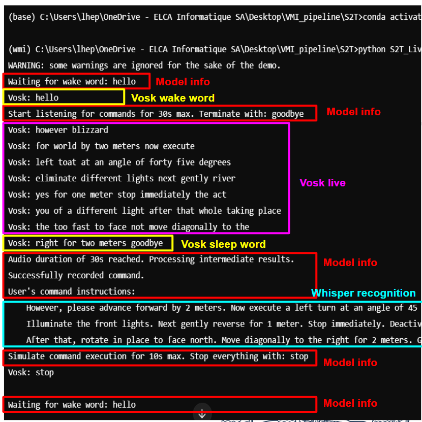
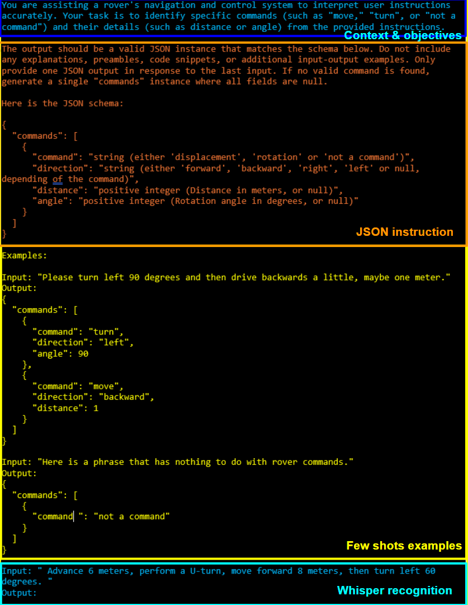

# Xplore - Human-Rover Communication

Welcome to the Human-Rover Communication project GitHub. The goal is to develop a rover capable of recognizing, understanding, and executing vocal commands (e.g., _Hello Kerby, go forward for 3 meters and turn 70 degrees left. Goodbye!_). Navigation and other commands must be highly precise, leaving no room for interpretation by the model. The system also considers the sentiment in your voice: if stress or fear is detected, the rover will execute actions faster. 

This GitHub repository serves to enhance reproducibility, documentation, and installation guidance.

## Table of Contents

- [Introduction](#introduction)
- [Model Overview](#model-overview)
  - [Speech-to-Text](#speech-to-text)
  - [Text-to-Commands](#text-to-commands)
  - [Sentiment Analysis](#sentiment-analysis)
  - [Command Execution](#command-execution)
- [Accepted Commands](#accepted-commands)
- [Installation](#installation)
- [TODO Ideas](#todo-ideas)

## Introduction

The workflow of the system is as follows:



The microphone used is a [Multidirectional Microphone](https://www.logitech.com/fr-ch/shop/p/yeti-orb-gaming-microphone.988-000551) from Logitech, which will be connected to the rover. The model is designed to be lightweight, work offline, and recognize English vocal commands.

A switch on the Control Station (CS) will control whether the vocal command recognition system is activated.

When the switch is activated, a ROS node called `vocom_node` starts running. It subscribes to the `CS/vocom` topic (receiving a boolean value from the switch) and publishes a [Joy message](https://docs.ros2.org/foxy/api/sensor_msgs/msg/Joy.html) to another topic. The idea is to create fake joystick commands, mimicking manual navigation mode, which are then processed as if the joystick or gamepad buttons were actually used. This `Joy` message is further processed into a [Twist message](https://docs.ros2.org/foxy/api/geometry_msgs/msg/Twist.html) for motor execution.

This node also starts a PyAudio stream from the microphone. First, it invokes the Speech-to-Text (S2T) model, followed by the Text-to-Commands (T2C) model. Finally, it checks the creation or modification of a `commands.json` file and sequentially executes the series of commands it contains. Throughout this workflow, several print statements ensure transparency, allowing the user to verify the rover's understanding. These include detecting wake words, the Whisper model's speech recognition result, the JSON generated by the LLM, and the executed commands.

## Model Overview

### 1. Speech-to-Text

As shown in the Project Overview, the S2T process combines two models:

First, Vosk is used. It has a lower WER rate but is less robust to noise. However, it is ideal for background processes for two reasons:  
1. It is lightweight (~50MB in size / ~300MB of RAM during runtime for the Small Vosk 40M model).  
2. It only needs to recognize specific distinguishable words (the wake, sleep, and stop words):  
   - `Hello` is the wake word. It signals the user is about to give commands, and the system starts recording audio.
   - `Goodbye` is the sleep word. It signals the end of user instructions, stopping the audio recording (which is then passed to Whisper).  
   - `Stop` is the stop word. If spoken during command execution, it halts all actions.  

Second, the state-of-the-art Whisper model from OpenAI is used. Whisper Base (74M) is robust against Martian-like or crowd noise. It achieves better performance with 30-second-long audio clips due to its attention mechanism. This is why Whisper is not used for live recognition of wake words (it also requires more computational resources). Whisper requires about 1GB of VRAM during runtime but only runs for a few seconds after the audio is recorded.  

Below is an example demonstrating the improvement between Vosk and Whisper for speech recognition (in text, punctuation, and capitalization):



### 2. Text-to-Commands

This component converts the unstructured, transcribed vocal instructions into a structured JSON format. The JSON contains a series of commands, each with specific properties and details. The schema is as follows:
```json
{
  "commands": [
    {
      "command": "string (either 'displacement', 'rotation' or 'not_a_command')",
      "direction": "string (either 'forward', 'backward', 'right', 'left', '180_turn', '360_turn' or null, depending on the command)",
      "distance": "positive integer (Distance in meters, or null)",
      "angle": "positive integer (Rotation angle in degrees, or null)"
    }
  ]
}
``` 

This schema was chosen for two reasons:
1. It is easier for the LLM to generate a valid instance (flat easier than nested).
2. It simplifies the addition of new commands.

The model used is Llama 3.2 3B, prompted with the following context:

```
You are assisting a rover's navigation and control system to interpret user instructions accurately. Your task is to identify specific commands (such as "move," "turn", or "not a command") and their details (such as distance or angle) from the provided instructions. 

The output should be a valid JSON instance that matches the schema below. Do not include any explanations, preambles, code snippets, or additional input-output examples. Only provide one JSON output in response to the last input. If no valid command is found, generate a single "commands" instance where all fields are null.
```

This system context is also supported by a few-shot learning approach, which has shown to improve performance. Below is an example of a complete prompt:



> To complete info:  (quantitized?), llama.cpp or Hugging face or Ollama? . If Llama.cpp, speak about json format., Otherwise, give the prompt example. 

### 3. Sentiment analysis
TO DO 

### 4. Commands execution
Once the commands are loaded into a JSON file, they are iterated through and executed sequentially. Each command is translated into and published as a Joy message. The default speed is set as a `Joy` value of 0.6. The distance is derived from the command. The publication duration is calculated using the formula $ v = \frac{d}{t} $.


## Accepted commands
The currently accepted commands are:

- `move`: Requires the `direction` field (either `forward` or `backward`) and the `distance` field (in meters, positive integer). If no `distance` is specified, the rover will not move. If a `distance` is specified but no `direction`, the rover defaults to moving forward.
- `turn`: Requires the `direction` field (either `left`, `right`, `180_turn`, or `360_turn`) and the `angle` field (in degrees, positive integer). If `direction` is `left` or `right` with angle as null or 0, it defaults to turning 90 degrees. If the `direction` is `180_turn` or `360_turn` but no `left` or `right` is specified, it defaults to turning left.

## Installation

Docker must be installed and running on your system. For guidance, refer to this [Xplore repository](https://github.com/EPFLXplore/ROS_Software_Assignement/blob/master/docs/InstallLinux.md). Alternatively, you can create a package and execute the nodes by following the instructions provided in this [GitHub repository](https://github.com/EPFLXplore/ROS_Software_Assignement/blob/master/docs/Level2.md).

### Create a ROS package (ALREADY DONE)
1. Navigate to the folder `docker_humble_desktop`. If the Docker container is not already running, start it using the run.sh script for Linux
```sh
./run.sh
```
2. Inside the Docker container, create a new workspace and a package:
```sh
cd src
ros2 pkg create --build-type ament_python vocal_command_pkg
```
3. Navigate to the package directory:
```sh
cd vocal_command_pkg
```

### Build and Run the Package
1. Navigate to the folder `docker_humble_desktop`. If the Docker container is not already running, start it using the run.sh script for Linux
```sh
./run.sh
```
If an error occurs showing the missing command `docker-compose`, install it using `sudo apt-get update && sudo apt-get install -y docker-compose`

2. In the dev_ws directory, build the package:
```sh
cd ~/dev_ws/
colcon build
```
This command compiles the package and sets up the necessary environment.

3. After building, source the setup file to overlay the workspace on your environment:
```sh
. install/setup.bash
```
This command sets up the environment variables needed to run the nodes. Now, your terminal is aware of the existing nodes. You will have to execute this command on every terminal you open to help it find your nodes.

4. Run the first node:
```sh
ros2 run vocal_command_pkg vocom_node
```

4. Open a new terminal, go inside the Docker container and run the second node:
```sh
docker exec -it base_humble_desktop bash
. install/setup.bash
ros2 run vocal_command_pkg fake_cs_node
```

## TODO Ideas

- Fix Max audio duration print statement
- See how Ollama interact
- Refine prompt example with gradient, or calculus, or yards, and add goodbye
- Add good bye to sleep words
- Add 180_turn and 360_turn to direction
- Implementer move right, left, diagnally to the right (turn then move)
- add slowly or fast or normal as a JSON field for the execution speed
- Github copilot pour les dev
- Confirmer elca tool pour bien flag et debut de reponses aux tickets
- Reflechir aux pdm, rag   tiny rag, graph rag pour usage interne
- IA automatisation, pour les RH